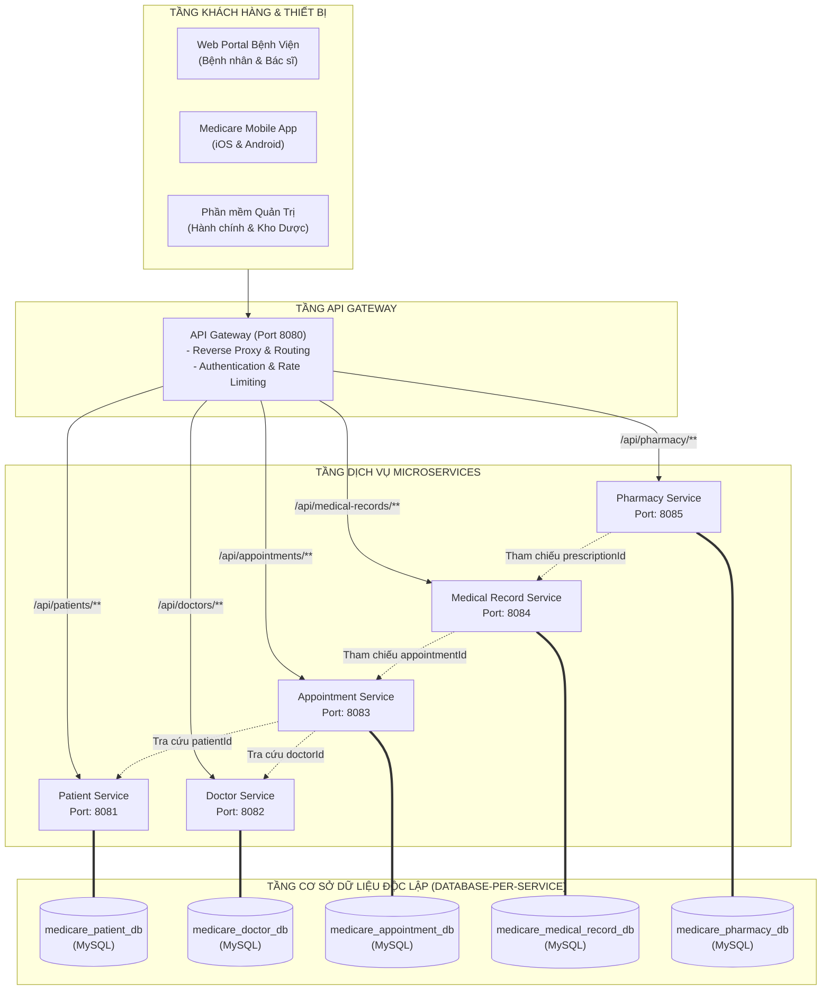

# BÁO CÁO BÀI TẬP 1: PHÂN TÍCH CHIA MODULE SERVICE VÀ THIẾT KẾ DATABASE CHO HỆ THỐNG QUẢN LÝ BỆNH VIỆN MEDICARE

**Môn học:** IT214 — Microservice in Action  
**Session:** 04 — Phân rã Monolithic & Thiết kế Database-per-Service  
**Cấp độ:** Vận dụng cơ bản  
**Đơn vị thực hành:** Bệnh viện Đa khoa MediCare  

---

## 1. YÊU CẦU 1 — PHÂN TÍCH VÀ CHIA MODULE MICROSERVICE

### 1.1. Xác định 5 Microservice từ nghiệp vụ cốt lõi

Từ khảo sát nghiệp vụ thực tế của Bệnh viện Đa khoa MediCare, hệ thống được phân rã thành 5 Bounded Contexts tương ứng với 5 Microservice độc lập:

1. **Patient Service (Cổng: 8081 | DB: `medicare_patient_db`)**
   - **Lý do tách:** Thông tin bệnh nhân là dữ liệu nhân khẩu học và bảo hiểm y tế cơ bản, có tần suất thay đổi thông tin cá nhân thấp nhưng yêu cầu tính riêng tư và bảo mật dữ liệu y tế nghiêm ngặt (HIPAA/GDPR). Bệnh nhân có thể tra cứu thông tin, đăng ký hồ sơ trước khi đến viện mà không gây áp lực lên hệ thống khám bệnh hay kho thuốc. Việc tách độc lập giúp tối ưu phân quyền truy cập và bảo vệ dữ liệu nhạy cảm.

2. **Doctor Service (Cổng: 8082 | DB: `medicare_doctor_db`)**
   - **Lý do tách:** Bác sĩ là nguồn nhân lực chuyên môn thuộc quản lý của phòng Tổ chức cán bộ và Phòng Kế hoạch tổng hợp. Tách riêng service này giúp quản lý danh mục chuyên khoa, ca làm việc, lịch trực và phòng khám bệnh độc lập. Lịch làm việc của bác sĩ có tần suất đọc (read-heavy) rất lớn khi bệnh nhân tìm kiếm đặt lịch, cho phép triển khai caching hiệu quả mà không làm ảnh hưởng đến các nghiệp vụ lâm sàng khác.

3. **Appointment Service (Cổng: 8083 | DB: `medicare_appointment_db`)**
   - **Lý do tách:** Đặt lịch khám là nghiệp vụ có lưu lượng truy cập biến động cực lớn (tải đột biến vào đầu giờ sáng hoặc khi bệnh viện mở đợt khám mới). Tách riêng Appointment Service cho phép hệ thống mở rộng quy mô độc lập (horizontal scaling/auto-scaling) và áp dụng các cơ chế chống tranh chấp khung giờ (slot concurrency locking) mà không làm chậm hệ thống quản lý hồ sơ hay kho dược.

4. **Medical Record Service (Cổng: 8084 | DB: `medicare_medical_record_db`)**
   - **Lý do tách:** Hồ sơ bệnh án điện tử (EMR) là nghiệp vụ lâm sàng có tính pháp lý y khoa cao nhất, yêu cầu tính toàn vẹn (audit trail, không cho phép tùy tiện chỉnh sửa hoặc xóa sau khi bác sĩ đã chốt phiên khám). Lưu lượng ghi (write-heavy) tập trung vào thời điểm bác sĩ kết thúc lượt khám. Tách riêng giúp đảm bảo an toàn dữ liệu bệnh án và có thể dễ dàng chuyển sang các công nghệ lưu trữ chuyên dụng như Document Store (MongoDB) nếu cần.

5. **Pharmacy Service (Cổng: 8085 | DB: `medicare_pharmacy_db`)**
   - **Lý do tách:** Quản lý kho dược phẩm là một quy trình logistics và tài sản tách biệt hoàn toàn với khám chữa bệnh. Kho thuốc có chu trình nhập hàng theo lô, theo dõi hạn sử dụng, cảnh báo ngưỡng tồn kho và xuất bán thuốc theo đơn. Tách riêng giúp bộ phận dược sĩ và kế toán viện hoạt động độc lập, không phụ thuộc vào hạ tầng đặt lịch hay khám bệnh.

---

### 1.2. Sơ đồ Kiến trúc Tổng thể (Architecture Diagram)

---

## 2. YÊU CẦU 2 — THIẾT KẾ DATABASE-PER-SERVICE & ERD

### 2.1. Tại sao tuyệt đối không nên để các Microservice dùng chung một Database?

1. **Gây khớp nối chặt ở tầng dữ liệu (Tight Coupling):** Khi nhiều service cùng đọc/ghi một database, việc thay đổi cấu trúc bảng (schema migration, đổi kiểu dữ liệu, đổi tên cột) của một service có thể âm thầm làm sập toàn bộ các service khác mà không có cảnh báo lúc compile.
2. **Phá vỡ tính đóng gói của Bounded Context:** Các lập trình viên thường có xu hướng viết câu lệnh SQL JOIN xuyên bảng trực tiếp giữa các module thay vì gọi qua API hợp đồng chuẩn. Điều này khiến ranh giới nghiệp vụ bị xóa nhòa và biến hệ thống thành một **"Distributed Monolith"** (Monolith phân tán) tồi tệ.
3. **Nghẽn cổ chai và Điểm sụp đổ duy nhất (Single Point of Failure):** Nếu một truy vấn nặng (complex report query) hoặc tình trạng khóa bảng (table lock/deadlock) xảy ra tại module Dược, toàn bộ nghiệp vụ Cấp cứu, Đặt lịch và Bệnh án đều bị tê liệt theo.
4. **Không tận dụng được lưu trữ đa mô hình (Polyglot Persistence):** Mỗi service có đặc thù dữ liệu riêng: Bệnh án phù hợp với Document DB (MongoDB), Lịch làm việc phù hợp với In-memory Cache (Redis), Kho thuốc phù hợp với ACID Relational DB (MySQL). Dùng chung 1 DB buộc toàn bộ hệ thống phải thỏa hiệp vào một giải pháp duy nhất.
5. **Khó khăn trong phân quyền và tuân thủ bảo mật (Data Privacy & Compliance):** Tiêu chuẩn bảo mật y tế đòi hỏi dữ liệu định danh bệnh nhân và bệnh án phải được mã hóa tại chỗ (encryption-at-rest) và kiểm soát truy cập nghiêm ngặt hơn nhiều so với danh mục thuốc.

---

### 2.2. Cách xử lý liên kết dữ liệu giữa các Service (Cross-Service Data Linking)

Khi áp dụng Database-per-Service, chúng ta giải quyết các bài toán liên kết dữ liệu thông qua 4 cơ chế chuẩn mực:

1. **Chỉ lưu Logical Reference ID:**
   - Trong bảng `appointments`, cột `patient_id` và `doctor_id` chỉ lưu số nguyên `BIGINT` đơn thuần. **Không có bất kỳ ràng buộc Foreign Key vật lý nào** sang database `medicare_patient_db` hay `medicare_doctor_db`.
   - Tương tự, `medical_records` lưu `appointment_id`, `patient_id`, `doctor_id`; `prescription_items` lưu `medication_id`.

2. **API Composition Pattern (Tổng hợp dữ liệu qua API):**
   - Khi cần hiển thị chi tiết một phiếu khám hẹn gồm: Mã lịch khám, Tên bệnh nhân, Số điện thoại, Tên bác sĩ, Chuyên khoa:
   - `appointment-service` (hoặc API Gateway / BFF) sẽ gọi song song các REST API:
     - `GET http://patient-service:8081/api/patients/{patientId}`
     - `GET http://doctor-service:8082/api/doctors/{doctorId}`
   - Sau đó ghép các thông tin lại thành DTO phản hồi hoàn chỉnh cho client.

3. **Phi chuẩn hóa có kiểm soát (Controlled Denormalization / Snapshot Data):**
   - Trong bảng `prescription_items`, ngoài `medication_id`, hệ thống lưu kèm trường snapshot `medication_name = "Amlodipine 5mg"` tại thời điểm kê đơn.
   - Nhờ đó, nếu sau này danh mục thuốc ở `Pharmacy Service` có cập nhật tên thương mại hay mã sản phẩm thì dữ liệu lịch sử đơn thuốc trong bệnh án của bệnh nhân vẫn bất biến và chính xác tuyệt đối.

4. **Kiến trúc hướng sự kiện (Event-Driven Architecture / Domain Events):**
   - Khi bác sĩ hoàn tất phiên khám, `Medical Record Service` phát ra sự kiện `MedicalRecordFinalizedEvent(recordId, prescriptionId, patientId)`.
   - `Pharmacy Service` lắng nghe sự kiện qua Message Broker (Kafka/RabbitMQ) để tự động tạo một phiếu xuất kho `dispense_orders` ở trạng thái `PENDING`, giúp dược sĩ chuẩn bị sẵn thuốc mà không cần gọi API đồng bộ.

---

### 2.3. Chi tiết ERD từng Cơ sở Dữ liệu

#### Database 1: `medicare_patient_db`
- **Bảng `patients`:**
  - `id` (BIGINT, PK, AUTO_INCREMENT)
  - `full_name` (VARCHAR(100), NOT NULL)
  - `date_of_birth` (DATE, NOT NULL)
  - `gender` (ENUM('MALE','FEMALE','OTHER'), NOT NULL)
  - `phone` (VARCHAR(15), INDEX)
  - `address` (VARCHAR(255))
  - `insurance_id` (VARCHAR(20), INDEX - Số thẻ BHYT)
  - `emergency_contact_phone` (VARCHAR(15))
  - `created_at` (DATETIME), `updated_at` (DATETIME)

#### Database 2: `medicare_doctor_db`
- **Bảng `departments`:**
  - `id` (BIGINT, PK, AUTO_INCREMENT)
  - `name` (VARCHAR(100), UNIQUE, NOT NULL - Tên khoa)
  - `description` (TEXT)
  - `location` (VARCHAR(100))
- **Bảng `doctors`:**
  - `id` (BIGINT, PK, AUTO_INCREMENT)
  - `department_id` (BIGINT, FK nội bộ trỏ tới `departments.id`)
  - `full_name` (VARCHAR(100), NOT NULL)
  - `specialty` (VARCHAR(100), INDEX)
  - `phone` (VARCHAR(15)), `email` (VARCHAR(100))
  - `room_number` (VARCHAR(20))
  - `status` (ENUM('ACTIVE','ON_LEAVE','RETIRED'))
  - `created_at`, `updated_at`
- **Bảng `doctor_schedules`:**
  - `id` (BIGINT, PK, AUTO_INCREMENT)
  - `doctor_id` (BIGINT, FK nội bộ trỏ tới `doctors.id`)
  - `day_of_week` (ENUM: MONDAY...SUNDAY)
  - `shift_start` (TIME), `shift_end` (TIME)
  - `max_patients_per_shift` (INT, default 20)
  - `status` (ENUM('AVAILABLE','BUSY'))

#### Database 3: `medicare_appointment_db`
- **Bảng `appointments`:**
  - `id` (BIGINT, PK, AUTO_INCREMENT)
  - `appointment_code` (VARCHAR(30), UNIQUE, NOT NULL)
  - `patient_id` (BIGINT, NOT NULL - Tham chiếu logic từ Patient Service)
  - `doctor_id` (BIGINT, NOT NULL - Tham chiếu logic từ Doctor Service)
  - `appointment_date` (DATE, NOT NULL, INDEX)
  - `time_slot` (VARCHAR(30), NOT NULL)
  - `reason` (VARCHAR(255))
  - `status` (ENUM('PENDING','CONFIRMED','COMPLETED','CANCELLED'))
  - `notes` (TEXT)
  - `created_at`, `updated_at`

#### Database 4: `medicare_medical_record_db`
- **Bảng `medical_records`:**
  - `id` (BIGINT, PK, AUTO_INCREMENT)
  - `appointment_id` (BIGINT, UNIQUE, NOT NULL - Tham chiếu logic từ Appointment Service)
  - `patient_id` (BIGINT, NOT NULL - Tham chiếu logic từ Patient Service)
  - `doctor_id` (BIGINT, NOT NULL - Tham chiếu logic từ Doctor Service)
  - `examination_date` (DATETIME, NOT NULL)
  - `blood_pressure` (VARCHAR(20)), `heart_rate` (INT), `weight_kg` (DECIMAL(5,2)), `temperature_c` (DECIMAL(4,2))
  - `diagnosis` (TEXT, NOT NULL - Chẩn đoán ICD-10)
  - `doctor_conclusion` (TEXT)
  - `status` (ENUM('IN_PROGRESS','FINALIZED'))
  - `created_at`, `updated_at`
- **Bảng `prescriptions`:**
  - `id` (BIGINT, PK, AUTO_INCREMENT)
  - `medical_record_id` (BIGINT, FK nội bộ trỏ tới `medical_records.id`)
  - `notes` (VARCHAR(255))
  - `created_at` (DATETIME)
- **Bảng `prescription_items`:**
  - `id` (BIGINT, PK, AUTO_INCREMENT)
  - `prescription_id` (BIGINT, FK nội bộ trỏ tới `prescriptions.id`)
  - `medication_id` (BIGINT, NOT NULL - Tham chiếu logic từ Pharmacy Service)
  - `medication_name` (VARCHAR(150), NOT NULL - Snapshot tên thuốc)
  - `dosage` (VARCHAR(100), NOT NULL)
  - `quantity` (INT, NOT NULL)
  - `instructions` (VARCHAR(255))

#### Database 5: `medicare_pharmacy_db`
- **Bảng `medications`:**
  - `id` (BIGINT, PK, AUTO_INCREMENT)
  - `code` (VARCHAR(50), UNIQUE, NOT NULL - Mã thuốc)
  - `name` (VARCHAR(150), NOT NULL - Tên biệt dược/hoạt chất)
  - `unit` (VARCHAR(20), NOT NULL - Viên, Vỉ, Hộp)
  - `unit_price` (DECIMAL(12,2), NOT NULL)
  - `manufacturer` (VARCHAR(100)), `description` (TEXT)
  - `created_at`, `updated_at`
- **Bảng `inventory`:**
  - `id` (BIGINT, PK, AUTO_INCREMENT)
  - `medication_id` (BIGINT, FK nội bộ trỏ tới `medications.id`)
  - `batch_number` (VARCHAR(50), NOT NULL - Số lô)
  - `expiry_date` (DATE, NOT NULL - Hạn dùng)
  - `quantity_in_stock` (INT, NOT NULL - Tồn kho)
  - `reorder_level` (INT, default 50)
  - `updated_at` (DATETIME)
- **Bảng `dispense_orders`:**
  - `id` (BIGINT, PK, AUTO_INCREMENT)
  - `prescription_id` (BIGINT, NOT NULL - Tham chiếu logic từ Medical Record Service)
  - `patient_id` (BIGINT, NOT NULL - Tham chiếu logic từ Patient Service)
  - `dispensed_by` (VARCHAR(100))
  - `status` (ENUM('PENDING','DISPENSED','CANCELLED'))
  - `dispensed_at` (DATETIME)
  - `total_amount` (DECIMAL(12,2))
- **Bảng `dispense_order_items`:**
  - `id` (BIGINT, PK, AUTO_INCREMENT)
  - `dispense_order_id` (BIGINT, FK nội bộ trỏ tới `dispense_orders.id`)
  - `medication_id` (BIGINT, FK nội bộ trỏ tới `medications.id`)
  - `quantity` (INT, NOT NULL)
  - `unit_price` (DECIMAL(12,2), NOT NULL)
  - `amount` (DECIMAL(12,2), NOT NULL)

---

## 3. YÊU CẦU 3 — CẤU HÌNH `application.yml` CHO TỪNG SERVICE

| Microservice | File cấu hình | Port | Database URL |
|---|---|:---:|---|
| **Patient Service** | [`patient-service/src/main/resources/application.yml`](file:///c:/Users/Admin/Desktop/code/IT214/Session%2004/Bai%201/patient-service/src/main/resources/application.yml) | `8081` | `jdbc:mysql://localhost:3306/medicare_patient_db` |
| **Doctor Service** | [`doctor-service/src/main/resources/application.yml`](file:///c:/Users/Admin/Desktop/code/IT214/Session%2004/Bai%201/doctor-service/src/main/resources/application.yml) | `8082` | `jdbc:mysql://localhost:3306/medicare_doctor_db` |
| **Appointment Service** | [`appointment-service/src/main/resources/application.yml`](file:///c:/Users/Admin/Desktop/code/IT214/Session%2004/Bai%201/appointment-service/src/main/resources/application.yml) | `8083` | `jdbc:mysql://localhost:3306/medicare_appointment_db` |
| **Medical Record Service** | [`medical-record-service/src/main/resources/application.yml`](file:///c:/Users/Admin/Desktop/code/IT214/Session%2004/Bai%201/medical-record-service/src/main/resources/application.yml) | `8084` | `jdbc:mysql://localhost:3306/medicare_medical_record_db` |
| **Pharmacy Service** | [`pharmacy-service/src/main/resources/application.yml`](file:///c:/Users/Admin/Desktop/code/IT214/Session%2004/Bai%201/pharmacy-service/src/main/resources/application.yml) | `8085` | `jdbc:mysql://localhost:3306/medicare_pharmacy_db` |

---

## 4. KẾT QUẢ XÁC MINH VÀ BUILD DỰ ÁN

Dự án đã được tổ chức dưới dạng **Gradle Multi-Module**, hỗ trợ build và test độc lập cả 5 Microservices:
- Lệnh kiểm tra: `.\gradlew.bat test`
- Kết quả: **BUILD SUCCESSFUL in 32s — 25/25 actionable tasks executed thành công 100%**.
- Mỗi service đều có bộ unit test kiểm tra khởi động Spring Boot Context và thao tác nạp dữ liệu JPA thành công.
