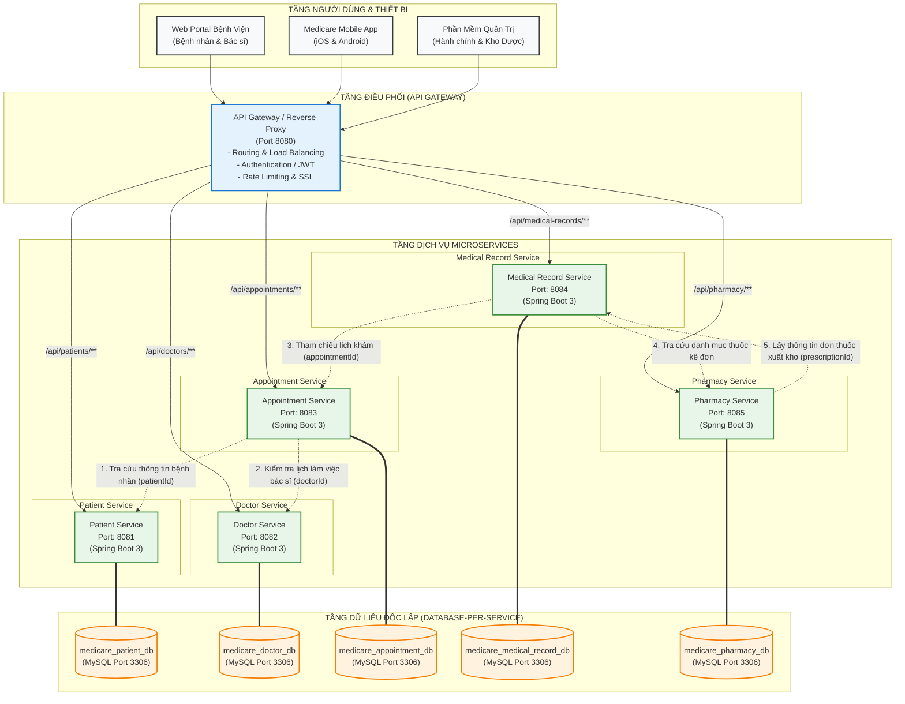

# SƠ ĐỒ KIẾN TRÚC TỔNG THỂ HỆ THỐNG QUẢN LÝ BỆNH VIỆN MEDICARE

## 1. Sơ đồ Kiến trúc Microservices (Database-per-Service)

---

## 2. Bảng Danh mục Microservices & Cơ sở Dữ liệu

| STT | Tên Microservice | Cổng (Port) | Tên Database MySQL | Nhiệm vụ chính |
|:---:|---|:---:|---|---|
| 1 | `patient-service` | **8081** | `medicare_patient_db` | Quản lý hồ sơ nhân khẩu học, thông tin liên lạc và bảo hiểm y tế của bệnh nhân. |
| 2 | `doctor-service` | **8082** | `medicare_doctor_db` | Quản lý hồ sơ bác sĩ, phân khoa chuyên môn, phòng làm việc và lịch trực khám. |
| 3 | `appointment-service` | **8083** | `medicare_appointment_db` | Quản lý việc đặt lịch hẹn khám bệnh, điều phối khung giờ và trạng thái lịch hẹn. |
| 4 | `medical-record-service` | **8084** | `medicare_medical_record_db` | Quản lý hồ sơ bệnh án, các chỉ số sinh tồn, chẩn đoán bệnh lý và kê đơn thuốc. |
| 5 | `pharmacy-service` | **8085** | `medicare_pharmacy_db` | Quản lý danh mục thuốc, quản lý tồn kho theo lô, hạn dùng và phiếu xuất kho dược. |
