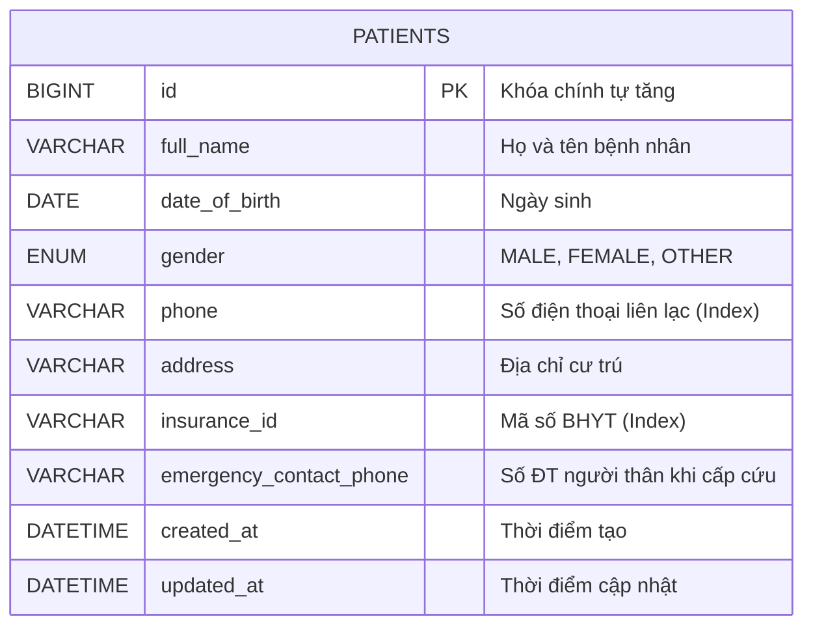
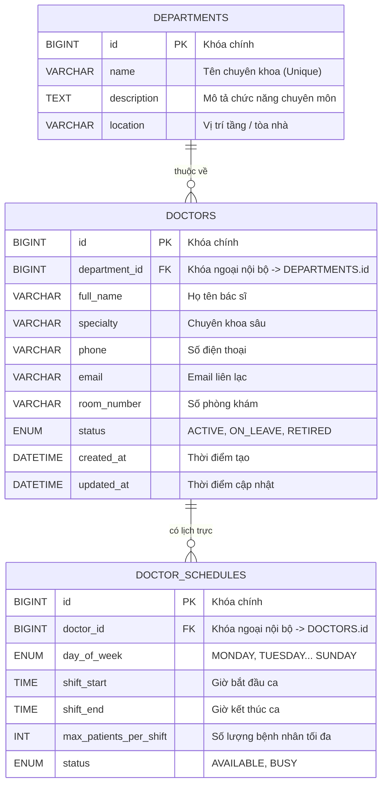
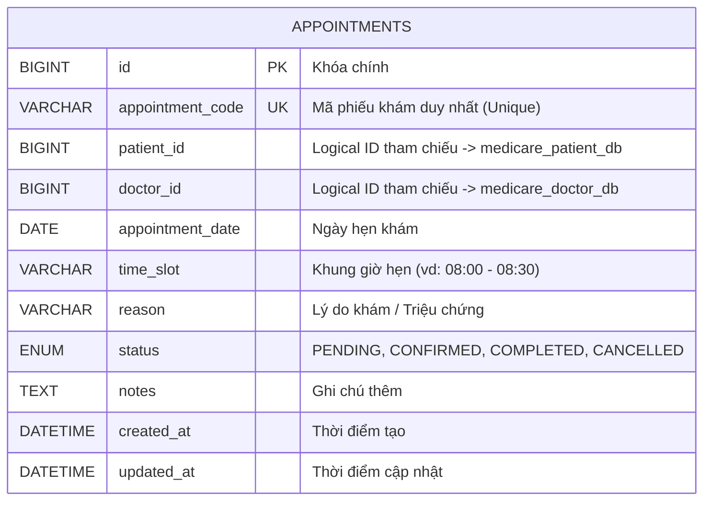
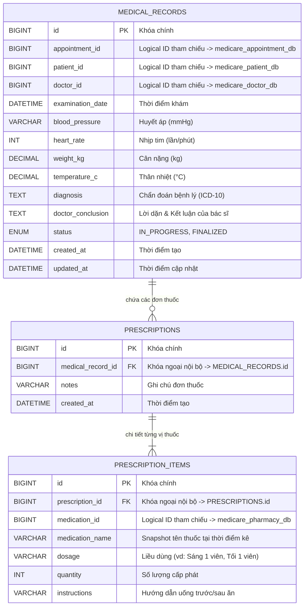
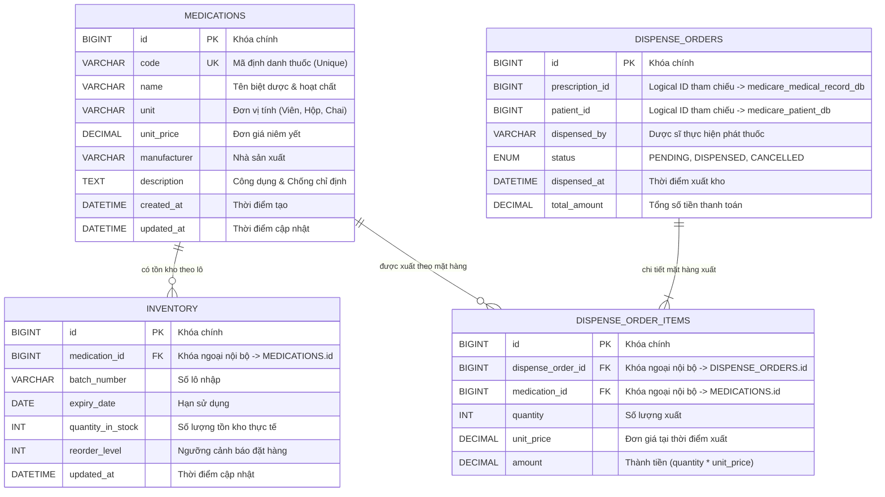
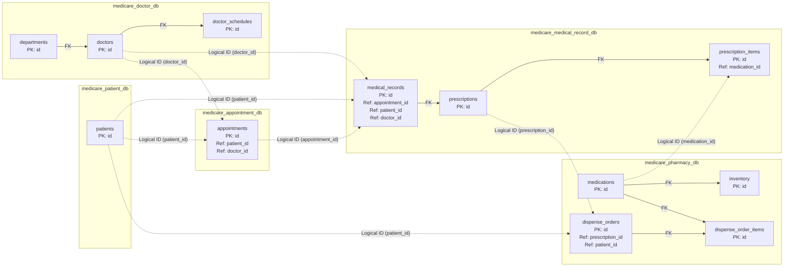

# THIẾT KẾ ENTITY-RELATIONSHIP DIAGRAM (ERD) TỪNG MICROSERVICE

Hệ thống quản lý bệnh viện **MediCare** áp dụng triệt để nguyên tắc **Database-per-Service**. Mỗi Microservice sở hữu hoàn toàn schema và cơ sở dữ liệu MySQL riêng biệt.

---

## 1. ERD: Patient Service (`medicare_patient_db`)

---

## 2. ERD: Doctor Service (`medicare_doctor_db`)

---

## 3. ERD: Appointment Service (`medicare_appointment_db`)

> **Ghi chú quan trọng:** `patient_id` và `doctor_id` trong bảng `APPOINTMENTS` là **Logical Reference ID**, không có ràng buộc Foreign Key vật lý (Physical Foreign Key) sang Database của `patient-service` hay `doctor-service`.

---

## 4. ERD: Medical Record Service (`medicare_medical_record_db`)

---

## 5. ERD: Pharmacy Service (`medicare_pharmacy_db`)

---

## 6. Sơ đồ Quan hệ Dữ liệu Toàn cảnh (Cross-Service Data Relationships)

